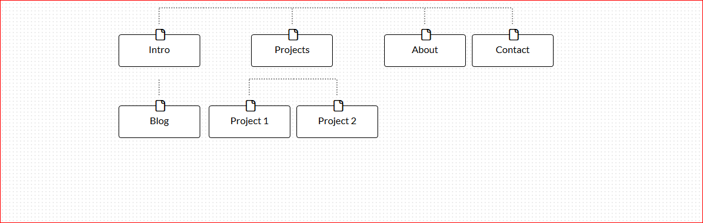

What are the 6 Phases of Web Design?
  1. Information Gathering
  2. Planning
  3. Design
  4. Development
  5. Test and Delivery
  6. Maintenance

What is your site's primary goal or purpose? What kind of content will your site feature?
+ My site's primary goal is to showcase my projects, resume, and blog posts for potential employers and the tech community. The site will have project snapshots and links, contact info, and articles I've written related to tech and community issues.

What is your target audience's interests and how do you see your site addressing them?
+ My target audience will be recruiters and employers. They will be looking for examples of my work and enthusiasm for development, which will be the main focus of the site.

What is the primary "action" the user should take when coming to your site? Do you want them to search for information, contact you, or see your portfolio? It's ok to have several actions at once, or different actions for different kinds of visitors.
+ The primary action is to view my portfolio and then contact me.

What are the main things someone should know about design and user experience?
+ Design involves planning out the site's structure, intent, and style choices. User experience focuses on how the user feels when interacting with the site.

What is user experience design and why is it valuable?
+ User experience tests how the user feels when they navigate through the site. It's value is in how it predicts conversion from "browser" to subscribers, purchases, followers, etc.

Which parts of the challenge did you find tedious?
+ The reflection :-) The challenge itself was straightforward, I didn't find it tedious at all.