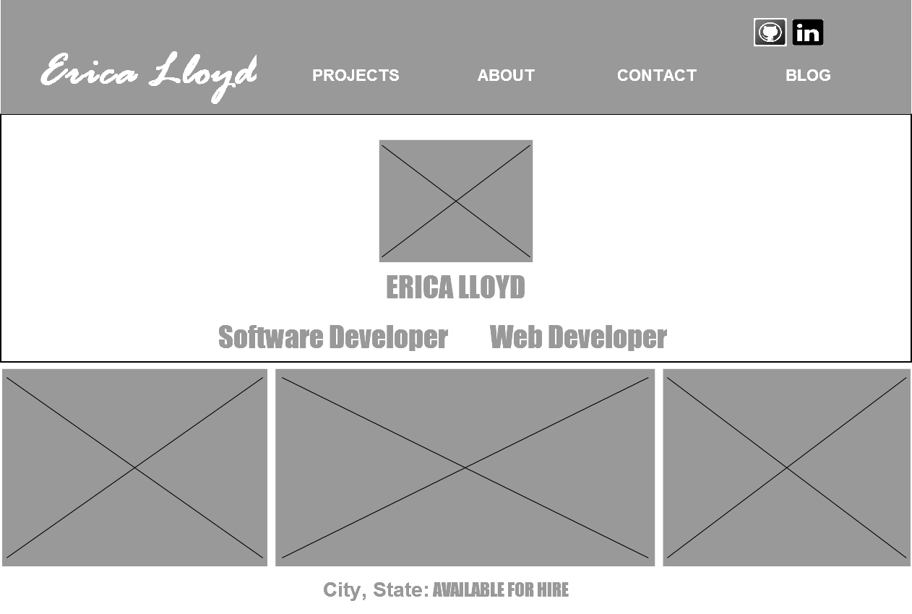
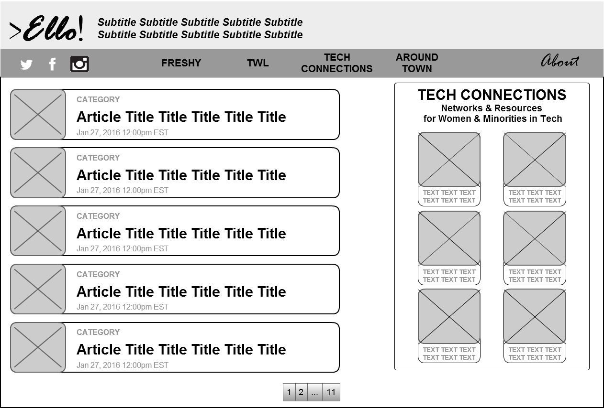

What is a wireframe?
+ A wireframe is a barebones mock-up of a website that helps designers plan the structure and layout of a webpage

What are the benefits of wireframing?
+ It's a quick way to get ideas out of your head and on to paper/screen so you can see if the layout will be visually pleasing.

Did you enjoy wireframing your site?
+ I really did enjoy the process. I knew that blogging was a part of DBC and previous to week 1 I wasn't sure if I'd have any ideas...but once I started really delving into I found plenty of inspiration. Wireframing helped me to choose a solid direction to go in.

Did you revise your wireframe or stick with your first idea?
+ I revised it several times. I know that when it comes to the "look" of things I can spend HOURS trying to get what I consider a perfect look. I purposely gave myself an hour to do the first draft, but over the following days I came back to it, found a tool I liked much better (Cacoo!) and re-did it.

What questions did you ask during this challenge? What resources did you find to help you answer them?
+ For my project/resume site I want to do a one-page scrolling site, instead of a landing page which has links to other pages. I was concerned that I wouldn't be able to do it if our upcoming challenges require us to turn in separate files for each page of the site. I asked our instructor about it and he encouraged me to stick with my plan and to tailor the assignments around my vision, not the around way around.

Which parts of the challenge did you enjoy and which parts did you find tedious?
+ The first wireframing tool I tried was Mockflow. The GUI was not intuitive and many of the features I would want to use were for paid users only. Tedious was definitely a good word for it. I switched to Cacoo and had a much better experience.
