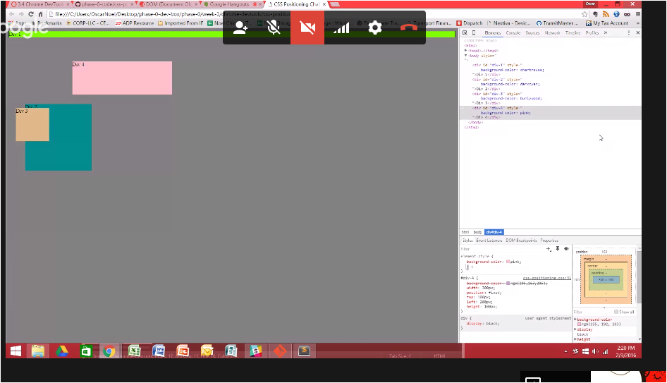
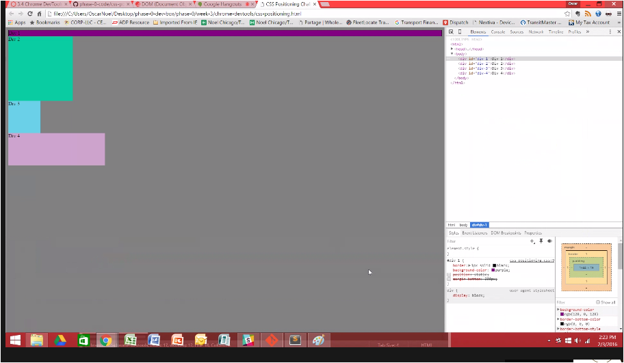
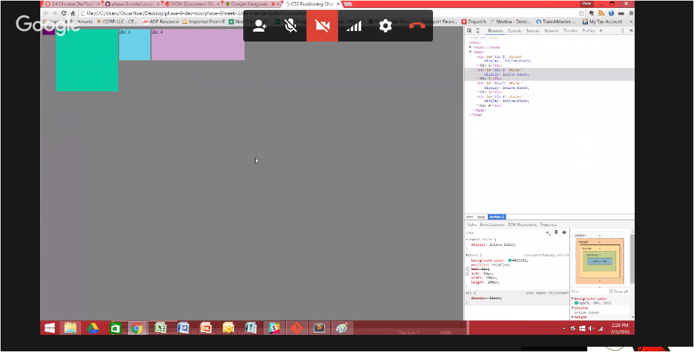
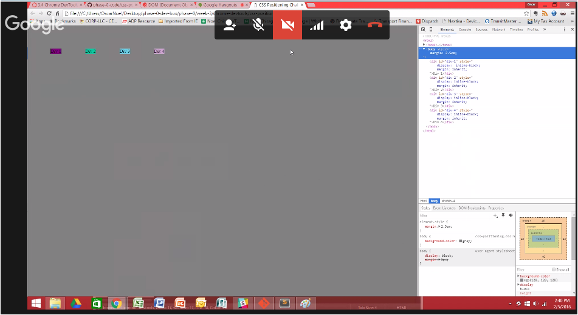
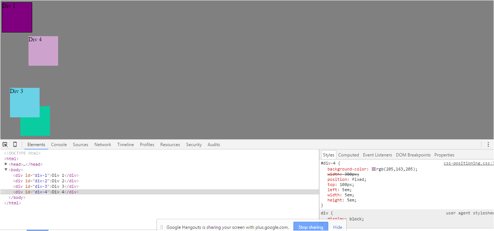
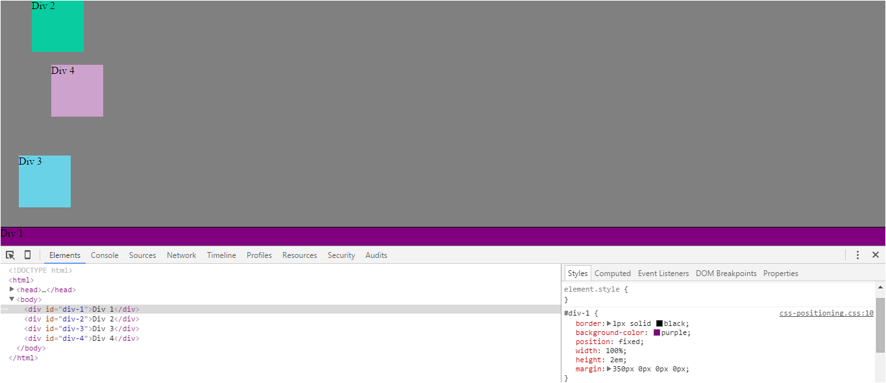
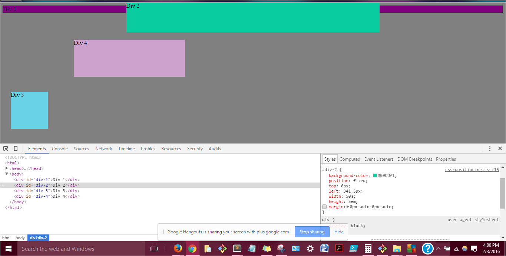
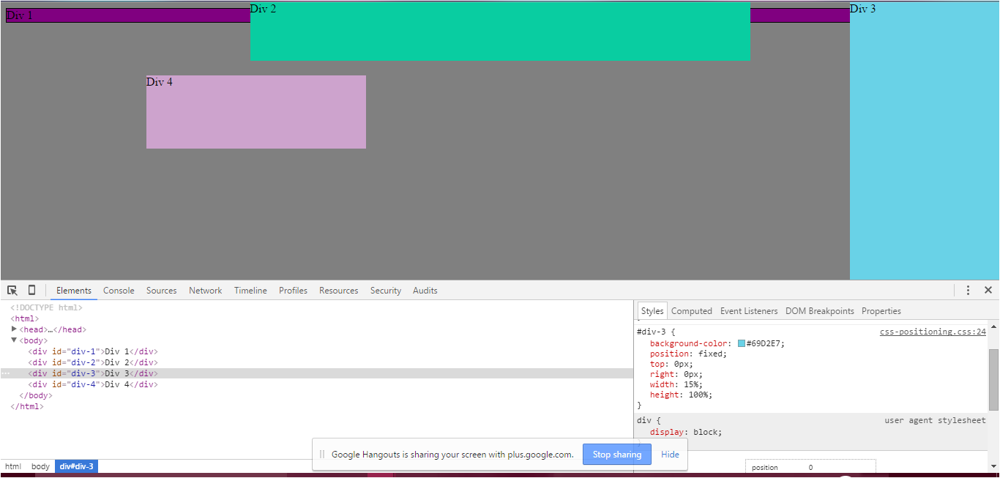
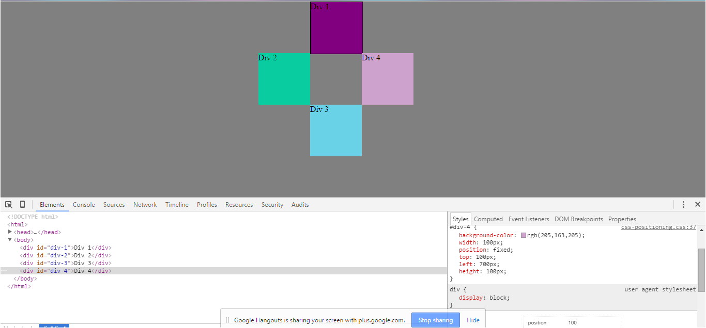

How can you use Chrome's DevTools inspector to help you format or position elements?
- By changing properties in the Styles/CSS window, you can view what the rendered html would look like. You can also click on elements to view their dimensions, which is very useful when calculating positions, margins, etc.

How can you resize elements on the DOM using CSS?
- In the html window, click on the element you want to resize. Then in the Styles window go the the selector and adjust the height and width.

What are the differences between absolute, fixed, static, and relative positioning? Which did you find easiest to use? Which was most difficult?
- Static positioning is the default for each element and sets each elements position relative to the <html> element.
- A fixed position is when the element is basically "glued" to the browser, with its position set using the top/right/bottom/left properties. The element will stay in the position regardless of the movement of other elements on the page.
- Relative positioning moves an elements relative to where it's starting position would be if it were static.
- An absolute position is the element's position relative to it's parent if non-static, otherwise it will be relative to the <html> element.
- The easiest to use is fixed because I know exactly where the element will be located at all times. The most difficult has been absolute b/c I have to remain aware of parent/child relationships when positioning.

What are the differences between margin, border, and padding?
- Padding is the space between content and it's border, INSIDE the "box". The border is the box's edge. Margins are the spaces AROUND the box and between each element's borders.

What was your impression of this challenge overall? (love, hate, and why?)
- Loved it. CSS positioning can be challenging at first. This activity introduced margins, padding, borders and position in a way that was fun and not intimidating. My pair and I enjoyed it and both learned. We also had different approaches to the different exercised so we benefitted by seeing multiple ways to accomplish the same result.