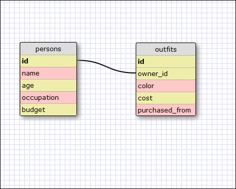

8.4 Intro to DB Schemas and SQL

1. 	SELECT * FROM states;

2. 	SELECT * FROM regions;

3. 	SELECT state_name, population
	FROM states;

4.	SELECT state_name, population
	FROM states
	ORDER BY population DESC;

5. 	SELECT state_name
	FROM states
	WHERE region_id = 7;

6. 	SELECT state_name, population_density
	FROM states
	WHERE population_density > 50
	ORDER BY population_density ASC;

7. 	SELECT state_name
	FROM states
	WHERE population
	BETWEEN 1000000 AND 1500000;

8.	SELECT state_name, region_id
	FROM states
	ORDER BY region_id ASC;

9. 	SELECT region_name
	FROM regions
	WHERE region_name LIKE "%Central%";

10. SELECT region_name, state_name
	FROM regions
	JOIN states ON
		regions.id = states.region_id
	ORDER BY region_id ASC;

### REFLECTION

What are databases for?

- Databases are used to store large amounts of data for quick access and query capabilities.

What is a one-to-many relationship?

- A relationship where a record in Entity A has a relationship with one or more records in Entity B.

What is a primary key? What is a foreign key? How can you determine which is which?

- A primary key is a column in which the values are unique and cannot be repeated. It's a way of making sure each record has a unique identifier. A foreign key is a primary key from one table located in another table. It creates the relationship between the 2 tables.

How can you select information out of a SQL database? What are some general guidelines for that?

- You use SQL query commands, which will all begin with SELECT. In the SELECT statement you include the columns that you want to retrieve/display data from.