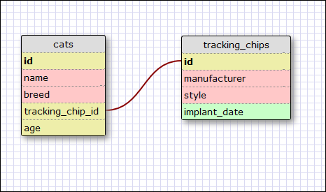

### REFLECTION
What is a one-to-one database?
- A database where each record in a table can have a relationship with exactly one record of another table, and vice versa.

When would you use a one-to-one database? (Think generally, not in terms of the example you created).
- You would use this when an entity has an attribute (or set of related attributes) that are optional and could either be null or populated. By moving the attributes to a separate table, you are preventing a waste of memory.

What is a many-to-many database?
- A database where one entity can have a relationship with many instances of another entity, and vice versa.

When would you use a many-to-many database? (Think generally, not in terms of the example you created).
- A many-to-many relationship would exist in any case where both entity instances can "own" multiple instances of each other. Ex: In a restaurant, a dish can be prepared by multiple cooks and cooks can prepare multiple dishes.

What is confusing about database schemas? What makes sense?
- I think the most challenging part will be translating the database's requirements into a schema that best models the relationships between the data entities.
